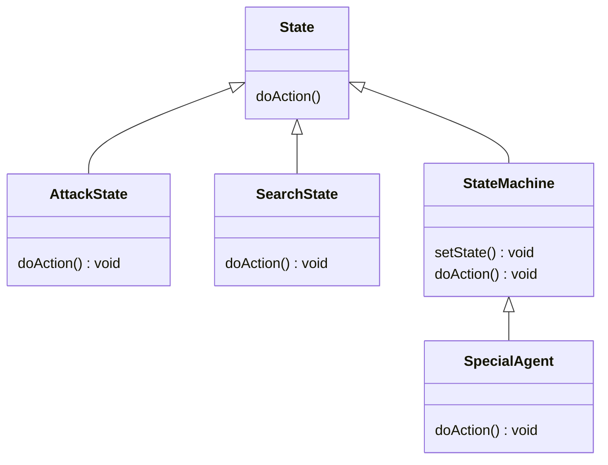
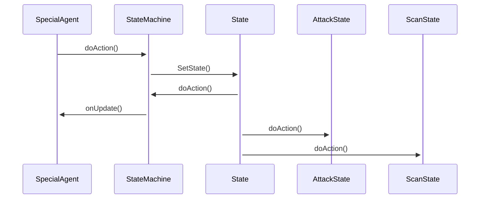

# py

```mermaid
classDiagram

State <|-- AttackState
State <|-- SearchState
State <|-- StateMachine
StateMachine <|-- SpecialAgent

State: doAction()

class AttackState{
doAction()void
}

class SearchState{
doAction()void
}

class StateMachine{
setState()void
doAction()void
}

class SpecialAgent{
doAction()void
}

```

#diagrame de séquance

```mermaid
sequenceDiagram
    SpecialAgent->>+StateMachine: doAction()
    StateMachine ->>+ State:SetState()
    State ->>+ StateMachine:doAction()
    StateMachine ->>+ SpecialAgent:onUpdate()
    State ->>+ AttackState:doAction()
    State ->>+ ScanState:doAction()

```
