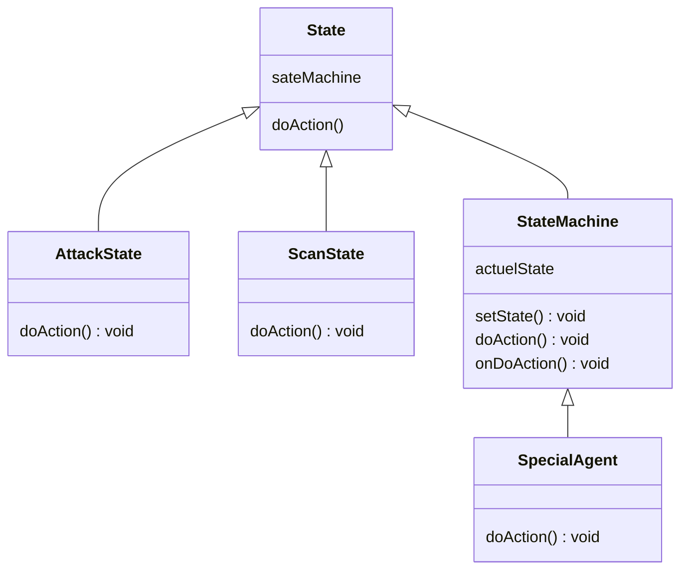
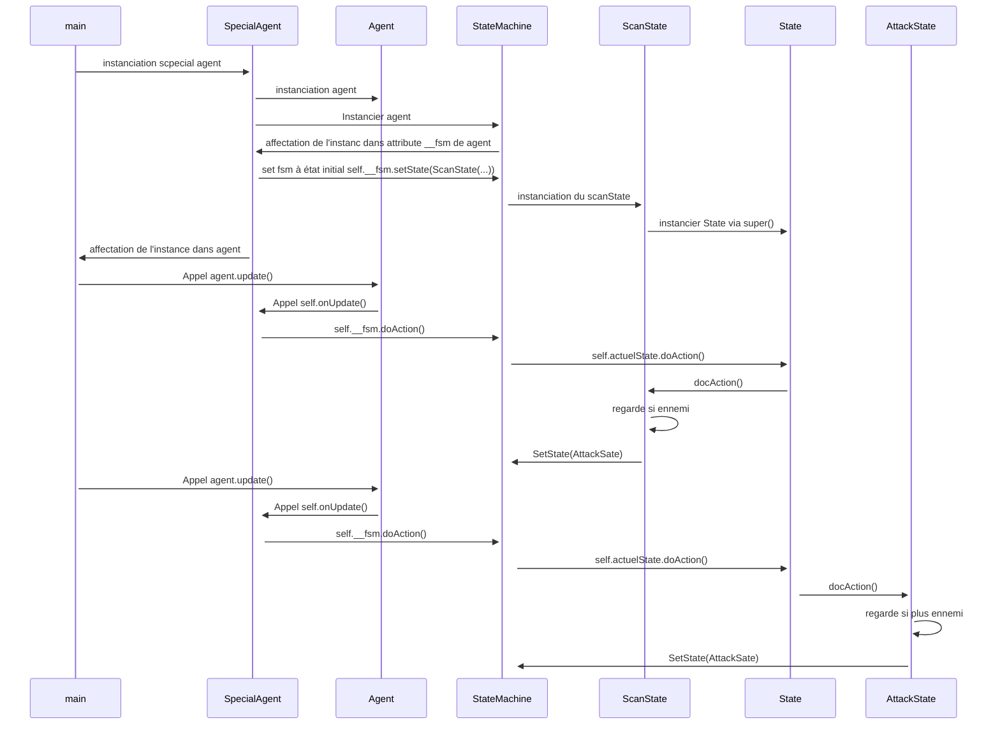

# py

```mermaid
classDiagram

State <|-- AttackState
State <|-- ScanState
State <|-- StateMachine
StateMachine <|-- SpecialAgent
State:sateMachine
State: doAction()

class AttackState{
doAction()void
}

class ScanState{
doAction()void
}

class StateMachine{
actuelState
setState()void
doAction()void
onDoAction()void
}

class SpecialAgent{
doAction()void
}

```

#diagrame de séquance

```mermaid
sequenceDiagram
   main ->>+ SpecialAgent:instanciation scpecial agent
   SpecialAgent ->>+ Agent:instanciation agent
    SpecialAgent->>+StateMachine: Instancier agent
    StateMachine ->>+ SpecialAgent:affectation de l'instanc dans attribute __fsm de agent
    SpecialAgent ->>+ StateMachine: set fsm à état initial self.__fsm.setState(ScanState(...))
    StateMachine ->>+ ScanState:instanciation du scanState
    ScanState ->>+ State:instancier State via super()
    SpecialAgent ->>+ main:affectation de l'instance dans agent

    main->>+ Agent: Appel agent.update()
    Agent ->>+SpecialAgent:Appel self.onUpdate()
    SpecialAgent ->>+StateMachine:self.__fsm.doAction()
    StateMachine ->>+ State:self.actuelState.doAction()
    State->>+ ScanState:docAction()
    ScanState->>+ ScanState :regarde si ennemi
     ScanState->>+ StateMachine:SetState(AttackSate)

    main->>+ Agent: Appel agent.update()
    Agent ->>+SpecialAgent:Appel self.onUpdate()
    SpecialAgent ->>+StateMachine:self.__fsm.doAction()
    StateMachine ->>+ State:self.actuelState.doAction()
    State->>+ AttackState:docAction()
    AttackState->>+ AttackState :regarde si  plus ennemi
     AttackState->>+ StateMachine:SetState(AttackSate)


```
